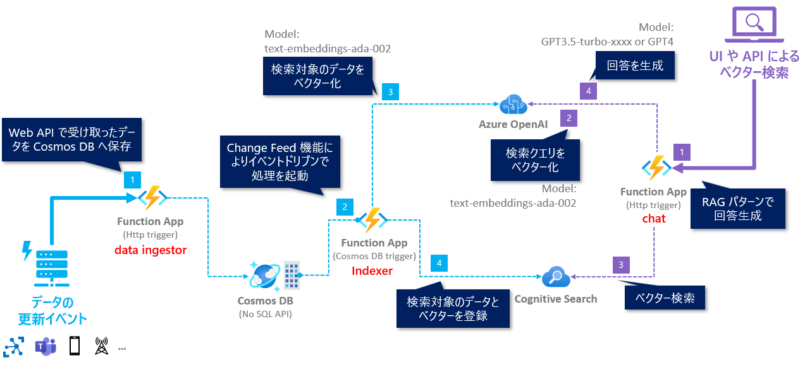

# Azure OpenAI Service x RAG パターン実践ハンズオン: Python 編

## 💫 概要とゴール

このハンズオンでは、Cosmos DB と AI Search をデータストアとした Retrieval Augmented Generation (RAG) パターンの実践として、以下を習得することがゴールです。

- 自社独自のデータを検索対象としたベクター検索が可能な検索インデックスの作成
  - このハンズオンでは、このリポジトリの[data/sample-data.json](./data/sample-data.json)にある Azure のサービスの一覧の情報を独自データとして利用し、検索インデックスを作成します。
- イベントドリブンによるリアルタイムで継続的な検索インデックスのデータ更新
- ベクター検索
- ベクター検索の結果を用いた LLM での回答生成

開発言語は、Python を利用します。

 

## 🗺️ アーキテクチャ構成

ハンズオンで実現するアーキテクチャ構成は以下となります。

Azure OpenAI と Cognitve Search を活用し以下のプログラムを実装して、ハンズオンのゴールを目指します。

- **data ingestor** (図:左側) の API で、独自のデータを受け取り Cosmos DB へデータを保存を実現
- **Indexer** (図:中央) で、Cosmos DB へのデータの登録・更新のイベントをトリガーにして、ほぼリアルタイムに AI Search のインデックス更新を実現
- **chat** (図:右側) の API で、受け付けた質問に対して、AI Search へのベクター検索と LLM を使った回答の生成を実現

 

## 🚧 Azure のリソース作成時の注意

**※ 今回のハンズオンでは、Auzre のリソースを作成することで料金が発生するリソースもあります。ご自身の状況に応じて、今回のハンズオンの最後にリソースグループごとすべて消すなどは自己責任で行なってください。**

 

## 🔖 ハンズオンの構成

0～3のチャプターで今回利用する Azure のリソースをセットアップし実装を進めていきます。

タイトル | 概要
--- | ---
[🧪 S1. Azure OpenAI Service のセットアップ](./docs/setup-azure-openai.md) | 今回のハンズオンで利用する Azure OpenAI Service のリソースをセットアップします。
[🧪 S2. Azure のリソースをセットアップ](./docs/setup-azure-resources.md) | 今回のハンズオンで利用する AI Search/Cosmos DB/Function App のリソースをセットアップします。
[🧪 D1. テンプレートのコードをセットアップ](./docs/setup-function-app-code.md) | 今回利用する Function App のコードのテンプレートをセットアップします。
[🧪 D2. indexer.py の実装](./docs/implement-indexer.md) | Function App で、Change Feed 機能を活用して AI Search のインデックスのデータを更新する処理を実装します。
[🧪 D3. RAG パターンのチャットを試す](./docs/implement-chat.md) | 更新した AI Search のインデックスをもとに RAG パターンのチャットを試します。
[🧪 D4. Azure へのデプロイ](./docs/deploy-to-azure.md) | Azure Functions へデプロイして動作確認をします。
[🚮 Azure のリソース削除](./docs/remove-azure-resources.md) | Azure のリソースを削除する方法を説明します。

 

## 🛠️ 事前準備

事前のミーティングでの内容をご確認ください。

## 🧑‍💻 Let's Get Started

以下のリンクからハンズオンの旅に出発しょう🚀

- [🧪 S1. Azure OpenAI Service のセットアップ](./docs/setup-azure-openai.md)
