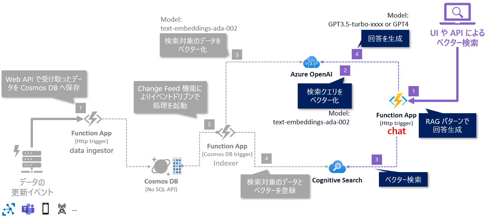

# 🧪 D3. RAG パターンのチャットを試す

ここでは、RAG パターンのチャットを実装した API を使って、チャットの回答を確認します。



<br>

## 🔖 実装内容の確認

短時間でのワークショップの時間の都合上、チャットのプログラムは、chat_app.py に実装済みです。  
プログラムは以下のフローで動作しています。

- A: REST API のリクエストから質問の文章の取得 (上図1)
- B: ベクター検索の結果を取得 (上図2, 3)
- C: ベクター検索の結果をもとに回答を生成し、レスポンスを返す (上図4)


<br>

## 🔖 デバッグ実行: ベクター検索の結果回答の生成

デバッグ実行して、以下のポイントを確認します。

- ✅ Function App をデバッグ実行して正常に起動することを確認
- ✅ REST.http を使って API をコールし、想定されたレスポンスが返ってくることを確認
  - クエリ文字列で query に任意の値を指定して実行


> [!NOTE]
> 具体的な操作が不明な場合は、メンターが質問にお答えしますのでお気軽にご質問ください。

<br>

正常に動作が確認できたら、サンプルデータにある108件のデータを一括で登録してみます。REST.http で以下のように書くと、指定してファイルの内容をそのまま送信できます。  

```
### data ingenstor: Upload all data
POST http://localhost:7071/api/data/upload_json
Content-Type: application/json

< ../data/sample-data.json
```

これで AI Search の Index が増えました。Azure のサービスについて色々な質問をしてみましょう。  
また、chat_app.py の89行目～102行目で定義してるシステムプロンプトを変更して、回答のフォーマットや口調を変えるなども試してみましょう。

例:「回答の口調は、こてこての関西弁でお願いします。」を追加する。


## ⏭️ NEXT STEP

これで RAG パターンを活用して LLM で回答を生成することができました。

次で最後のセクションとなります。Azure 上の Function App へコードをデプロイして、クラウド上での動作確認を行います。


---

[⏮️ 前へ](./implement-indexer.md) | [📋 目次](../README.md) | [⏭️ 次へ](./deploy-to-azure.md)
