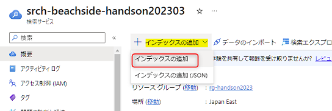
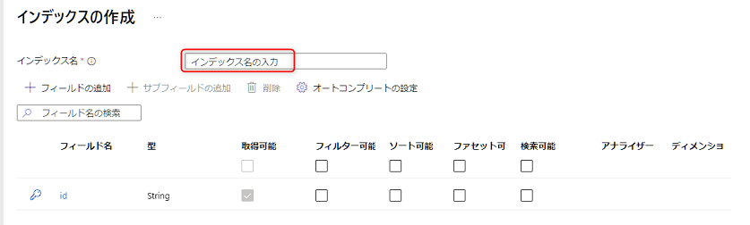
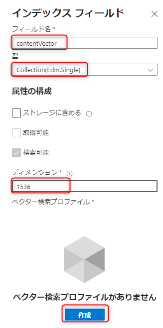
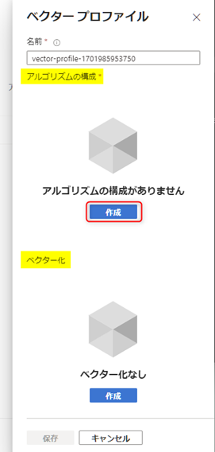
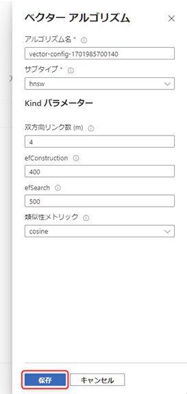
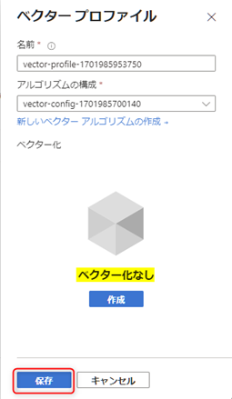
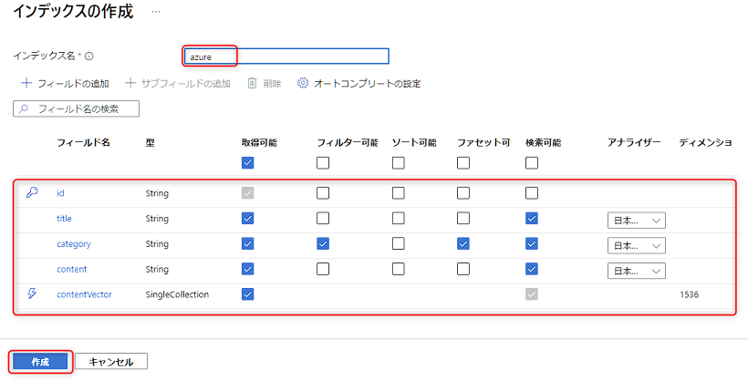
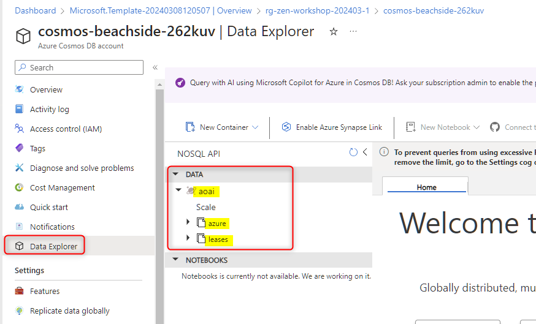

# 🧪 S2. Azure のリソースをセットアップ

ここでは、以下のステップで Azure OpenAI Service 以外の3つのリソースをセットアップします。

- ARM template からリソース作成
- Azure AI Search: インデックスの作成
- Azure Cosmos DB: データベースとコンテナーの作成

## 🔖 ARM template からリソース作成

以下の `Deploy to Azure` のボタンをクリックすることで、Azure ポータルに遷移して3つのリソースを作成するための画面が開きます。

- Azure AI Search
- Azure Cosmos DB
- Azure Functions

> [!NOTE]
> Azure ポータルでの操作は具体的な操作はトレーナーが説明します。

 

> [!TIP]
> `Deploy to Azure` ボタンをクリックして作成される Azure のリソースを、Azure Portal で手作業で個別に作成する方法については以下をご参照ください。
>
> - [1. Azure AI Search のリソース作成](./setup-ai-search.md)
> - [2. Azure Cosmos DB のリソース作成](./setup-cosmos-db.md)
> - [3. Azure Functions のリソース作成](./setup-function-app.md)

 

## 🔖 AI Search: インデックスの作成

AI Search のリソースを表示して、概要の上部にある "インデックスの追加" > "インデックスの追加" をクリックします。

 

インデックスの作成画面が表示されます。インデックス名に「azure」と入力します。

 

次に "フィールドの追加" をクリックしてフィールドを追加します。以下図を参考に3つのフィールドを追加します。

フィールド名 | 型 | 取得可能 | フィルター可能 | ソート可能 | ファセット可能 | 検索可能 | アナライザー
--- | --- | :---: | :---: | :---: | :---: | :---: | ---
title | Edm.String | ✅ | - | - | - | ✅ | 日本語 - Microsoft
category | Edm.String | ✅ | ✅ | - | ✅ | ✅ | 日本語 - Microsoft
content | Edm.String | ✅ | - | - | - | ✅ | 日本語 - Microsoft

 

最後に、ベクターの値を格納するためのフィールドを追加します。入力は以下図を参考に入力します。

- フィールド名: `contentVector`
- 型: `Collection(Edm.Single)`
- ディメンション: `1536`

> !{CAUTION}
> ディメンションが表示されない場合、型が `Collection(Edm.Single)` になっているかを再確認しましょう。

入力後「ベクター検索プロファイルがありません」の表記の下にある "作成" をクリックします。

 

ベクタープロファイルの作成画面が表示されます。今回は、下部にある **"ベクター化"は不要なので作成しません。**  
上部にある**アルゴリズムの構成** の "作成" をクリックします。

以下図の画面が表示されますのでデフォルトの値のままで "保存" をクリックします。

> ※ この値に関してご興味がありましたら、以下のドキュメントをご参照ください。
>
> - [ベクター検索の概念 | Microsoft Learn](https://learn.microsoft.com/ja-jp/azure/search/vector-search-overview#why-use-vector-search)

ベクタープロファイルの画面が表示されます。ベクター化なしのままで、"保存" をクリックします。

インデックスフィールドの画面に戻るので、もう一度 "保存" をクリックします。これでこのフィールドの追加が完了です。

 

最終的に以下のようなインデックスを構成したことを確認して左下の "作成" をクリックします。

のちほど AI Search でインデックスにデータが入っていることを確認するので、ブラウザのタブはこのまま開いておきます。

 

## 🔖 Cosmos DB: リソースの確認

Cosmos DB は、リソースを作成すると "データベースアカウント" が作成された状態になります。  

AI Search を開いているブラウザのタブとは別にタブを開き、Azure portal で Cosmos DB のリソースを開きます。

左側のメニュー "Data Explorer" をクリックして、aoai データベースの中に "azure" と "leases" のコンテナーが存在することを確認します。

 

リソースの確認は以上です。のちほど Cosmos DB でデータが入っていることを確認するので、ブラウザのタブはこのまま開いておきます。

 

## 📚 参考情報

### Azure AI Search

- [Azure AI Search の概要 | Microsoft Learn](https://learn.microsoft.com/ja-jp/azure/search/search-what-is-azure-search)
- [Azure AI Search のインデックス | Microsoft Learn](https://learn.microsoft.com/ja-jp/azure/search/search-what-is-an-index)

### Azure Cosmos DB

このワークショップでは、Cosmos DB に関する説明は、AI からそれるため、時間の都合で省略しています。参考情報としてドキュメントの一部を紹介します。

- [Azure Cosmos DB の概要 | Microsoft Learn](https://learn.microsoft.com/ja-jp/azure/cosmos-db/introduction)
- [Azure Cosmos DB で API を選択する | Microsoft Learn](https://learn.microsoft.com/ja-jp/azure/cosmos-db/choose-api)
- [Azure Cosmos DB のデータベース、コンテナー、アイテム | Microsoft Learn](https://learn.microsoft.com/ja-jp/azure/cosmos-db/resource-model)
- [Azure Cosmos DB の要求ユニット(RU) | Microsoft Learn](https://learn.microsoft.com/ja-jp/azure/cosmos-db/request-units)
- [Azure Cosmos DB のデータ モデリング](https://learn.microsoft.com/ja-jp/azure/cosmos-db/nosql/modeling-data)
- [Azure Cosmos DB でのパーティション分割と水平スケーリング | Microsoft Learn](https://learn.microsoft.com/ja-jp/azure/cosmos-db/partitioning-overview)

 

## ⏭️ NEXT STEP ✨

おめでとうございます🎉。ワークショップで利用するすべての Azure のリソースの準備が完了しました。次はコードの実装に進みます。

[⏮️ 前へ](./setup-azure-openai.md) | [📋 目次](../README.md) | [⏭️ 次へ](./setup-function-app-code.md)
