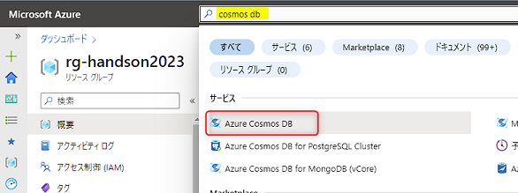
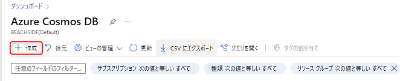
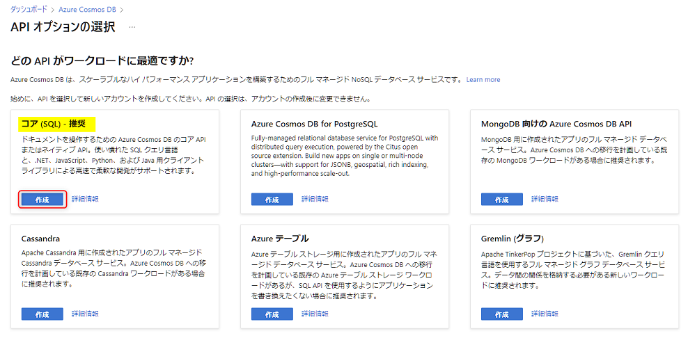
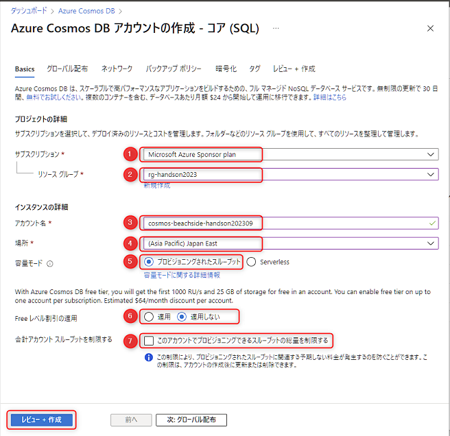
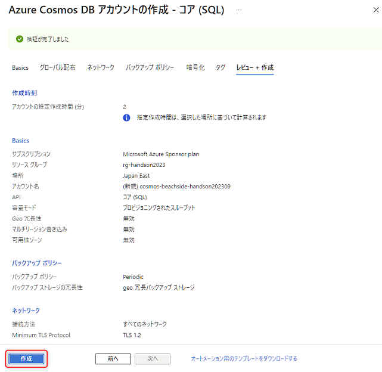

# 🧪 2. Cosmos DB のセットアップ

Cosmos DB は、NoSQL データベースで、フルマネージドの PaaS になります。ここでは、Cosmos DB で以下を実践します。

- 2-1. Cosmos DB のリソース作成
- 2-2. データベースとコンテナーの作成

## 2-1. Cosmos DB のリソース作成

Azure portal から Cosmos DB のリソースを作成します。  
先ほど開いた AI Search のタブとは別のタブで Azure portal (`portal.azure.com`) を開き、上部の検索で「cosmos db」と入力して表示される "Azure Cosmos DB" をクリックします。

 

Cosmos DB の一覧が表示されますので、上部にある "作成" をクリックします。

 

API オプションの選択が表示されます。"コア (SQL)" の "作成" をクリックします。

 

Cosmos DB アカウントの作成画面が表示されます。以下を参考に入力して、"レビュー + 作成" をクリックします。

 No. | 項目 | 入力内容
---: | --- | ---
1 | サブスクリプション | 任意のサブスクリプションを選択します。
2 | リソースグループ | このハンズオンで作成したリソースグループを選択します。
3 | アカウント名 | 任意の名称を入力します。これはグローバルで一意の名称になる必要があります。例:「cosmos-xxxx-handson202311」( "xxx" は自分のハンドルネームや任意のプロジェクト名など) 。
4 | 場所 | AI Search と同じ場所を選択します。
5 | 容量モード | "プロビジョニングされたスループット" を選択します。
6 | Free レベル割引の適用 | 「適用しない」選択します。
7 | 合計アカウントスループットを制限する | チェックをオフにします。

 

検証が完了したら "作成" をクリックします。

作成は3分程度でできます。完了したら、"リソースに移動" をクリックします。

## 2-2. データベースとコンテナーの作成

Cosmos DB は、リソースを作成すると "データベースアカウント" が作成された状態になります。  
Cosmos DB の基本的な構成は、"データベースアカウント" の中に "データベース" があり、その中に実際にデータを格納する "コンテナー" があります。ここでは "データベース" と "コンテナー" を作成します。

Cosmos DB のリソースを表示したら、左側のメニューから "データ エクスプローラー" をクリック (①) → "New Container" をクリック (②) します。

紹介の動画が表示された場合は消します。そして、以下を参考に入力して "OK" をクリックします。1分程度で完了します。

 No. | 項目 | 入力内容
---: | --- | ---
1 | Database id | "Create new" を選択し、「aoai」と入力します。
2 | Share throughput across containers | チェックをオンにします。
3 | Database throughput (autoscale) | "Autoscale" を選択します。
4 | Database Max RU/s | 「1000」と入力します。
5 | Container id | 「azure」と入力します。
6 | Partition key | 「/id」と入力します。

 

## 📚 参考情報

このワークショップでは、Cosmos DB に関する詳細は時間の都合のため省略しています。参考情報としてドキュメントの一部を紹介します。

- [Azure Cosmos DB の概要 | Microsoft Learn](https://learn.microsoft.com/ja-jp/azure/cosmos-db/introduction)
- [Azure Cosmos DB で API を選択する | Microsoft Learn](https://learn.microsoft.com/ja-jp/azure/cosmos-db/choose-api)
- [Azure Cosmos DB のデータベース、コンテナー、アイテム | Microsoft Learn](https://learn.microsoft.com/ja-jp/azure/cosmos-db/resource-model)
- [Azure Cosmos DB の要求ユニット(RU) | Microsoft Learn](https://learn.microsoft.com/ja-jp/azure/cosmos-db/request-units)
- [Azure Cosmos DB のデータ モデリング](https://learn.microsoft.com/ja-jp/azure/cosmos-db/nosql/modeling-data)
- [Azure Cosmos DB でのパーティション分割と水平スケーリング | Microsoft Learn](https://learn.microsoft.com/ja-jp/azure/cosmos-db/partitioning-overview)

---

[📋 目次](../README.md)
