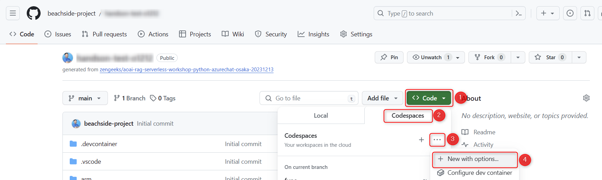
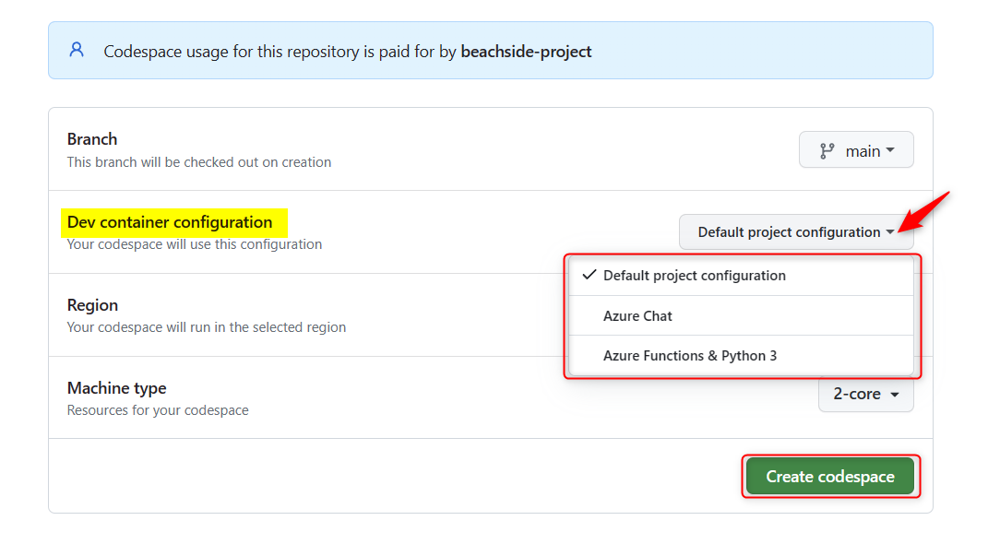
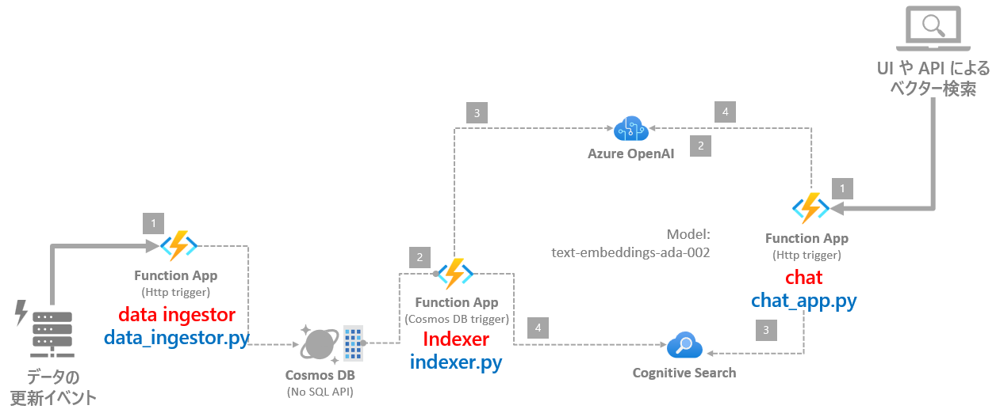
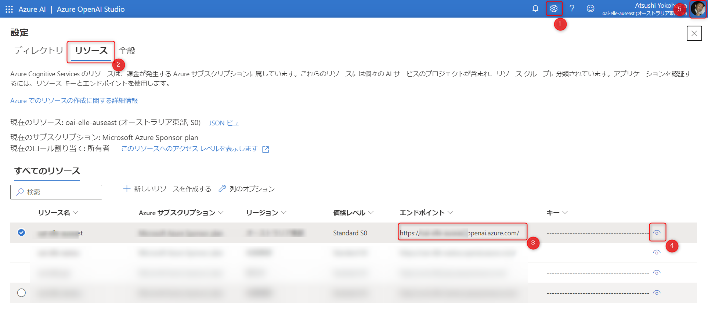
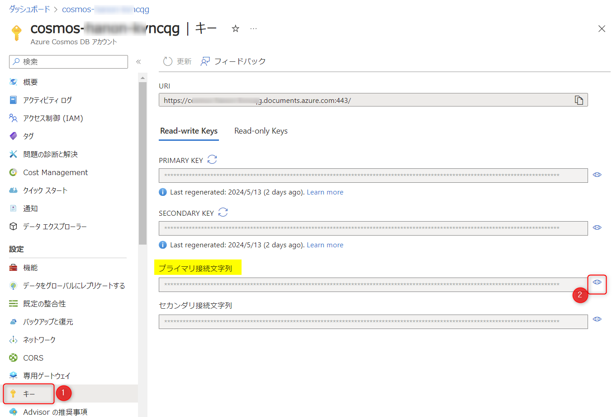
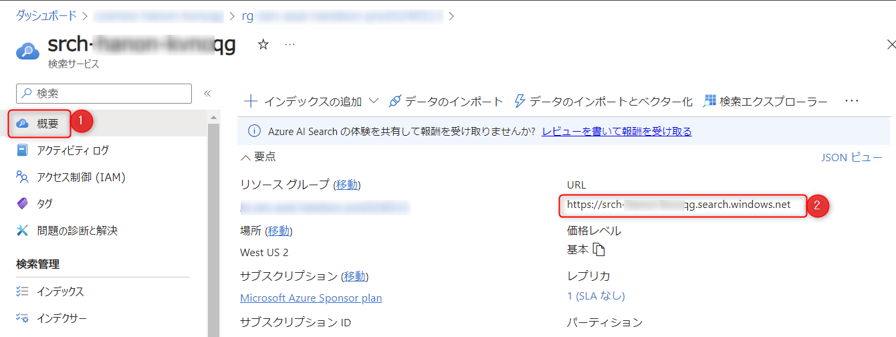
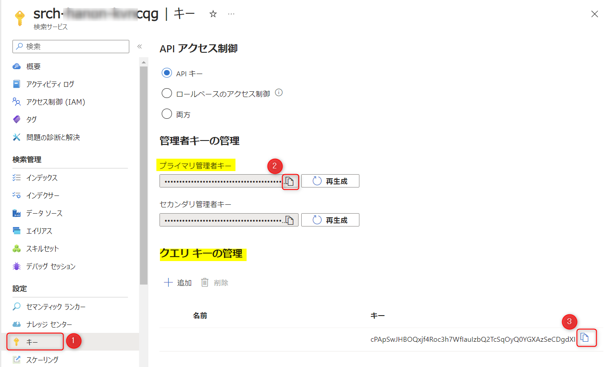

# 🧪 D1. テンプレートのコードをセットアップ

**GitHub Codespaces** は、Python などの言語を利用しているときに開発者個々の環境で相違が起きがちな開発環境を制御し、統一して開発を進めることができます。  
このハンズオンは、GitHub の Codespaces のメリットを活かし、全員が統一された開発環境でハンズオンを行ないます。

ここでは、以下のステップで Codespaces の起動確認と `handson-app` がデバッグ実行できるようにセットアップします。

- Codespaces の起動
- handson-app の構成
- デバッグ実行の準備
- デバッグ実行

<br>


## 🔖 Function App 専用 のCodespaces を起動

ここからは、Function App 専用の GitHub Codespaces を利用してハンズオンを進めます。  

今回ハンズオンを行う repo で、"Code" ボタンをクリック (①) → "Codespaces" をクリック (②) → "..." をクリック (③) → "New with options" をクリック (④) します。




Cteate for Codespace の画面が表示されます。"Dev container configuration" で **Azure Functions & Python 3** を選択し "Create codespace" をクリックすると、Codespaces が起動します。



起動まで数分かかります。起動すると、ブラウザ上で VS Code が起動します。

<br>

## 🔖 handson-app の構成

Codespaces を起動すると、`handson-app` がルートとして開かれるように設定しています。 この中には Function App のコードに3つのトリガーの関数が含まれています。3つの関数の実装を更新し、ワークショップのゴールを目指します。

> [!NOTE]
> 具体的な操作はトレーナーが解説します。


Function | トリガー | 概要
--- | --- | ---
chat_app.py | HTTP Trigger | チャットの API です。ベクター検索と ChatGPT を使った回答の生成をします。
data_ingestor.py | HTTP Trigger | AI Search のインデックスの元となるデータをインジェストするための API です。
indexer.py | Cosmos DB Trigger| イベントドリブンでリアルタイムに AI Search のインデックスを更新するための処理です。

> [!WARNING]
> 今回はハンズオンでは、操作性の観点から1つの Function App に複数の Function を実装して進めます。本来は、スケーラビリティの観点から Function をまとめるか分けるかを考慮するのがベストプラクティスです。



<br>

## 🔖 デバッグ実行の準備: 環境変数のセットアップ

Azure Functions での開発において、環境辺素やシークレットは、local.settings.json で構成します。

ここでは、`handson-app` をデバッグ実行するために必要となる local.settings.json をセットアップします。

まず、以下のコマンドを実行して、local.settings.json を作成します。

```bash
cp local.settings.json.sample local.settings.json 
```

次に、生成された local.settings.json を開き、Azure OpenAI Serivce / Cosmos DB / AI Search の3つのリソースから情報を取得して設定します。

### 環境変数の設定 1/3: Azure OpenAI Service

Azure OpenAI Studio ( <https://oai.azure.com/> )を開き、エンドポイントと API キーの2つを設定します。

- 画面上部のギアのアイコン (下図①) をクリック
- リソースタブをクリック (下図②)
- 今回利用するリソースのエンドポイント (下図③) をコピーします。
- Codespace 上で local.settings.json を開き、`AZURE_OPENAI_ENDPOINT` の値に、コピーした値を入力します。
- Azure OpenAI Studio に戻り、**キー** (下図④) のボタンをクリックして、キーの値をコピーします。
- Codespace 上で local.settings.json を開き、`AZURE_OPENAI_API_KEY` の値に、コピーした値を入力します。

> [!NOTE]
> ※ 今回のハンズオン用に Azure OpenAI Service を作っておらず、既存でお持ちの Azure OpenAI Service を使う場合は、以下の設定も追加して行います。
>
> - Azure OpenAI Studio で "デプロイ" を開き、モデル `text-embedding-ada-002` のデプロイ名を、local.settings.json の `DEPLOYMENT_NAME_ADA` の値に設定します。
> - Azure OpenAI Studio で "デプロイ" を開き、利用する GPT 系のモデルのデプロイ名を、local.settings.json の `DEPLOYMENT_NAME_GPT` の値に設定します。




<br>

### 環境変数の設定 2/3: Cosmos DB

Azure Portal (<https://portal.azure.com/>) を開き、今回利用する Cosmos DB のリソースを開きます。

- 左側のメニューで "キー" (下図①)をクリックし、「プライマリ接続文字列」の右側にある目のアイコン (下図②) をクリックします。
- 接続文字列が表示されるのでコピーします。
- Codespace 上で local.settings.json を開き、`COSMOS_CONNECTION` の値に、コピーした値を入力します。



<br>

### 環境変数の設定 3/3: AI Search

Azure Portal (<https://portal.azure.com/>) を開き、今回利用する AI Search のリソースを開きます。エンドポイントと2種類のキーを設定します。

**エンドポイントの設定:**

- 左側のメニューで "概要" (下図①)をクリックし、URL の値 (下図②) をコピーします。
- Codespace 上で local.settings.json を開き、`AI_SEARCH_ENDPOINT` の値に、コピーした値を入力します。



<br>

**キーの設定:**

- 左側のメニューで "キー" (下図①)をクリックし、「プライマリ管理者キー」のコピーボタン (下図②) をクリックします。
- Codespace 上で local.settings.json を開き、`AI_SEARCH_ADMIN_KEY` の値に、コピーした値を入力します。
- 左側のメニューで "キー" (下図①)をクリックし、クエリキーのコピーボタン (下図③) をクリックします。
- Codespace 上で local.settings.json を開き、`AI_SEARCH_QUERY_KEY` の値に、コピーした値を入力します。



<br>

## 🔖 デバッグ実行

デバッグ実行をします。エディターにカーソルを当てた状態で `F5` キーを押すと、デバッグを実行します。または VS Code 左側のアイコン "Run and Debug" からデバッグを実行します。

> [!CAUTION]
**デバッグ開始時に「タスク 'func: host start' を見つけられませんでした。」が表示された場合**
>
> VS Code のコマンドパレット (`CTRL` + `SHIFT` + `P`) を開いて、「reload」と入力し、"**開発者: ウィンドウの再読み込み" (Developer: Reload Window)** を実行することで解消する可能性が高いです。

以下のポイントを参考に `handson-app` が正常に動作することを確認します。

- ✅ デバッグの実行で起動時にエラーがでないことを確認
- ✅ REST.http の中にある REST API のリクエストを実行して、正常に動作することを確認

<br>

## 📚 参考情報

このワークショップでは Function App の詳細は時間の都合のため省略しています。参考情報としてドキュメントの一部を紹介します。

- [Azure Functions の概要 - Microsoft Learn](https://learn.microsoft.com/ja-jp/azure/azure-functions/functions-overview?pivots=programming-language-python)
- [Azure Functions でのトリガーとバインドの概念 | Microsoft Learn](https://learn.microsoft.com/ja-jp/azure/azure-functions/functions-triggers-bindings?tabs=isolated-process%2Cpython-v2&pivots=programming-language-python)
- [Azure Functions 開発者ガイド | Microsoft Learn](https://learn.microsoft.com/ja-jp/azure/azure-functions/functions-reference?tabs=blob&pivots=programming-language-python)
- [クイックスタート: Visual Studio Code と Python を使用して Azure に関数を作成する | Microsoft Learn](https://learn.microsoft.com/ja-jp/azure/azure-functions/create-first-function-vs-code-python?pivots=python-mode-decorators)
- [Azure Functions のベストプラクティス | Microsoft Learn](https://learn.microsoft.com/ja-jp/azure/azure-functions/functions-best-practices?tabs=csharp)

<br>

## ⏭️ NEXT STEP ✨

これでコードをセットアップできました。次は、3つの Function の中で Intexer.py から実装を進めます。

---

[⏮️ 前へ](./setup-azure-resources.md) | [📋 目次](../README.md) | [⏭️ 次へ](./implement-indexer.md)
